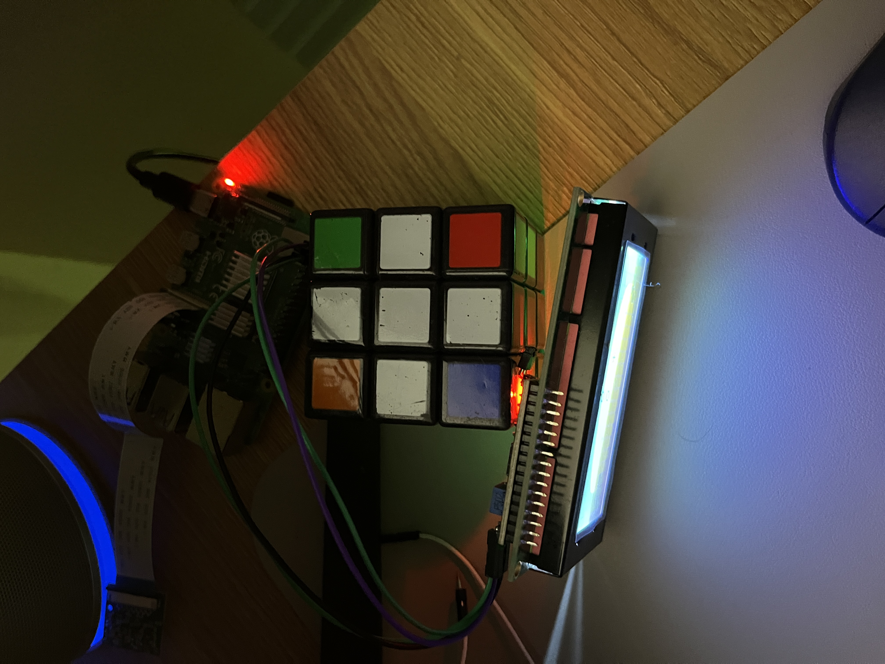
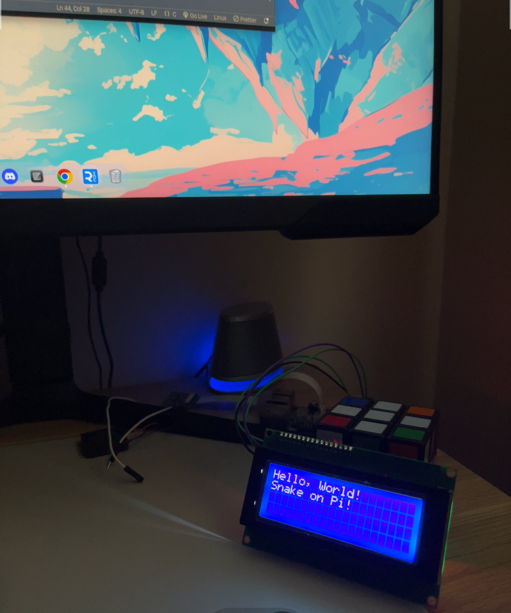

# Pi Snake Game on 16x2 LCD 

Hi guys I will be making **Pi Snake Game** with C and with the help of gpt 4o-mini, a fun project using a **Raspberry Pi 4**, **16x2 LCD screen**, and some **jumper wires**. 

## Game Overview

This is a retro snake game of the one found on the classic **Nokia 3310**! You control the snake's movement using the arrow keys on your keyboard. The snake grows as it eats food, and the game uses a **16x2 LCD screen** for the display. The twist? The snake wraps around the screen when it reaches the edges. The goal is simple: **grow the longest snake possible!**

---

## Features

- **16x2 LCD Display**: The game is displayed on the small 16x2 LCD, making it a unique gaming experience.
- **Keyboard Controls**: Move the snake using the arrow keys on your keyboard.
- **Snake Growth**: The snake grows longer each time it eats food.
- **Food Generation**: Randomly generated food items appear on the screen for the snake to eat.
- **Edge Wrapping**: The snake reappears on the opposite side of the screen when it reaches an edge.

---

## Hardware Setup

- **Raspberry Pi 4**
- **16x2 LCD screen** (I2C interface)
- **Jumper wires**
- **Breadboard (optional)**

Here's a sample setup of the hardware:




## LCD Testing
To test for the lcd, try running **test_lcd.c** in the **src** directory.

if successful you should get :
<br>



---

## 🛠️ Installation and Setup

### 1. Prerequisites

the Raspberry Pi should be  set up with :

```bash
sudo apt-get install wiringpi libncurses5-dev
